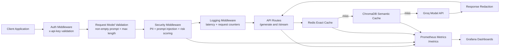

# AI Guardrail Proxy

AI Guardrail Proxy is an  LLM guardrail gateway built with FastAPI. It sits in front of a model provider and enforces authentication, prompt safety checks, response redaction, caching, observability, and cost tracking for LLM traffic.


## What It Does

- Authenticates API requests with an `x-api-key` header
- Validates prompt size and rejects empty requests
- Detects prompt injection attempts and common PII patterns
- Sanitizes prompts before model execution and cache storage
- Redacts sensitive data from model responses before returning them
- Supports exact-match Redis caching and semantic ChromaDB caching
- Streams responses over SSE with final metadata
- Exposes Prometheus metrics and Grafana dashboards

## Architecture

```text
Client
  -> Auth Middleware
  -> Security Middleware
  -> Logging Middleware
  -> Route Handler
  -> Hybrid Cache (Redis exact + ChromaDB semantic)
  -> Groq API
  -> Response Redaction
  -> Prometheus / Grafana
```

Security and validation happen before cache lookup so raw sensitive input is screened before reuse or storage.



## Request Lifecycle

1. A client calls `POST /generate` or `POST /stream`.
2. `AuthMiddleware` checks the `x-api-key` header.
3. `PromptRequest` validates the prompt is non-empty and below the configured maximum length.
4. `SecurityMiddleware` scans the prompt for:
   - PII
   - prompt injection
   - overall risk score
5. If the request is high risk, the gateway blocks it with HTTP `403`.
6. If the request is allowed, the sanitized prompt is passed to the route handler.
7. `groq_service` checks Redis exact cache first.
8. If no exact hit exists, it checks the ChromaDB semantic cache.
9. If both caches miss, the proxy calls Groq directly.
10. The response is redacted, costed, cached, and emitted with request metadata.

## Key Features

### Security

- API-key authentication for LLM endpoints
- Prompt injection detection
- Regex-based PII detection
- Risk scoring with configurable blocking
- Sanitization of sensitive input before model calls
- Response-side redaction before return and cache write

### Caching

- Redis exact cache for identical prompts
- ChromaDB semantic cache for near-duplicate prompts
- SHA-256 cache keys derived from normalized prompt text
- Cache metadata includes request id, token counts, cost, and security context

### Observability

- Prometheus metrics exposed at `/metrics`
- Grafana dashboard provisioning included in the repo
- Tracks:
  - request counts
  - request duration
  - cache lookups and writes
  - model latency
  - token usage
  - estimated cost
  - security events
  - blocked prompts

## Requirements

- Python 3.9+
- Groq API key
- Redis
- Docker for the observability stack

## Installation

Install dependencies:

```bash
pip install -r requirements.txt
```

## Configuration

Create a `.env` file in the project root and set at least:

```env
GROQ_API_KEY=your_groq_api_key_here
API_KEYS=test-api-key,another-key
REQUIRE_API_KEY=true
REDIS_URL=redis://localhost:6379/0
ENABLE_PII_MASKING=true
BLOCK_PROMPT_INJECTION=true
BLOCK_HIGH_RISK_PROMPTS=true
MAX_RISK_SCORE=0.8
MAX_PROMPT_CHARS=4000
MAX_RESPONSE_CHARS=12000
EMBEDDING_MODEL_NAME=BAAI/bge-small-en-v1.5
CACHE_SIMILARITY_THRESHOLD=0.15
CACHE_TTL_SECONDS=3600
CHROMA_COLLECTION_NAME=semantic_cache
```

## Run the API

Start the service from the project root:

```bash
uvicorn app.main:app --reload
```

Useful endpoints:

- `GET /` basic root response
- `GET /health` liveness check
- `GET /ready` readiness check
- `GET /metrics` Prometheus metrics

## API Usage

### Generate

```bash
curl -s -X POST http://127.0.0.1:8000/generate \
  -H "Content-Type: application/json" \
  -H "x-api-key: test-api-key" \
  -d "{\"prompt\":\"Explain transformer architecture in simple terms\"}"
```

Expected response fields include:

- `status`
- `response`
- `request_id`
- `cache_hit`
- `prompt_tokens`
- `completion_tokens`
- `total_tokens`
- `estimated_cost`
- `risk_score`
- `pii_detected`
- `prompt_injection_detected`

### Stream

```bash
curl -N -X POST http://127.0.0.1:8000/stream \
  -H "Content-Type: application/json" \
  -H "x-api-key: test-api-key" \
  -d "{\"prompt\":\"Explain transformers briefly\"}"
```

The stream emits `data:` chunks and ends with a final `__meta` event.

## Observability Stack

Start Prometheus and Grafana:

```bash
docker compose -f docker-compose.observability.yml up -d
```

Services:

- Prometheus: http://localhost:9090
- Grafana: http://localhost:3000

Grafana default credentials:

- Username: `admin`
- Password: `admin`

Prometheus scrape target:

```text
host.docker.internal:8000
```

## Tests

Run the test suite:

```bash
python -m pytest -q
```

The current tests cover:

- API authentication
- blocked prompt handling
- health and readiness endpoints
- exact-cache hit behavior
- live model response behavior


## Project Structure

```text
app/
  api/              FastAPI routes
  core/             Configuration, logging, pricing, request IDs
  middleware/       Auth, security, and logging middleware
  models/           Pydantic request models
  observability/    Prometheus metrics helpers
  security/         PII detection, prompt guard, sanitization, risk scoring
  services/         Groq integration and hybrid cache
observability/
  prometheus/       Prometheus config
  grafana/          Grafana provisioning and dashboard JSON
tests/              Minimal regression tests
```
