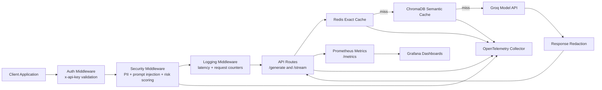

# AI Guardrail Proxy

AI Guardrail Proxy is a production-oriented LLM gateway built with FastAPI. It sits in front of a model provider and adds authentication, prompt safety checks, request redaction, exact and semantic caching, resilience controls, observability.

## What It Solves

This project is designed to show how a real AI proxy can protect upstream models and production users at the same time. It helps with:

- API authentication for model traffic
- Prompt injection detection and blocking using a classifier-first guardrail with structural tripwires
- PII detection and prompt sanitization using Presidio-backed detection with safe fallback
- Response redaction and output hardening before return and cache write
- Exact-match Redis caching
- Semantic ChromaDB caching
- Retry, timeout, circuit-breaker, and fallback behavior
- Structured logging and request correlation
- Prometheus metrics, Grafana dashboards, and OpenTelemetry tracing
- Automated tests and load-test evidence

## Architecture

```text
Client
  -> Auth Middleware
  -> Security Middleware
  -> Logging Middleware
  -> Route Handler
  -> Hybrid Cache (Redis exact + ChromaDB semantic)
  -> Groq API
  -> Response Redaction
  -> Prometheus / Grafana
  -> OpenTelemetry Collector
```

Security and validation happen before cache lookup so raw sensitive input is screened before reuse or storage.



## Request Lifecycle

1. A client calls `POST /generate` or `POST /stream`.
2. `AuthMiddleware` checks the `x-api-key` header.
3. `SecurityMiddleware` scans the prompt for PII, injection patterns, and risk score.
4. If the request is high risk, the gateway blocks it with HTTP `403`.
5. If the request is allowed, the sanitized prompt is passed to the route handler.
6. `resilient_groq_service` checks Redis exact cache first.
7. If exact cache misses, it checks ChromaDB semantic cache.
8. If both caches miss, the proxy calls the primary Groq model with timeout, retry, and circuit-breaker protection.
9. If the primary model fails, the proxy tries a fallback model.
10. If all model paths fail, the proxy returns a degraded response instead of a raw 500.
11. The response is redacted, cached, traced, and returned with request metadata.

## Key Features

### Security

- API-key authentication for model endpoints
- Classifier-backed prompt injection detection with regex tripwires and structural delimiter checks
- Presidio-backed PII detection with regex fallback for narrow secret formats
- Behavior-aware probabilistic risk scoring using Redis-backed probing signals
- Sanitization of sensitive input before model calls
- Response-side redaction, HTML escaping, and system-prompt canary leak protection

### Resilience

- Request and dependency timeouts
- Groq retry with backoff
- Per-model circuit breaker
- Secondary model fallback
- Degraded response path for total upstream failure

### Caching

- Redis exact cache for identical prompts
- ChromaDB semantic cache for near-duplicate prompts
- SHA-256 cache keys derived from normalized prompt text
- Cache metadata includes request ID, token counts, cost, and security context

### Observability

- JSON logs with correlation IDs
- OpenTelemetry trace spans through the request path
- Prometheus metrics exposed at `/metrics`
- Grafana dashboard provisioning included in the repo
- Alerting rules for latency, failures, cache health, and security spikes

## Repository Structure

```text
app/
  api/              FastAPI routes
  core/             Configuration, logging, pricing, request IDs, resilience
  middleware/       Auth, security, and logging middleware
  models/           Pydantic request models
  observability/    Prometheus metrics and OpenTelemetry helpers
  security/         PII detection, prompt guard, sanitization, risk scoring
  services/         Groq integration and hybrid cache
load_test/          Locust load-testing harness
observability/
  otel/             OpenTelemetry Collector config
  prometheus/       Prometheus config and alerts
  grafana/          Grafana provisioning and dashboard JSON
tests/              Regression, resilience, and red-team coverage
```

## Requirements

- Python 3.12+
- Groq API key
- Docker
- Redis
- ChromaDB and SentenceTransformers dependencies

## Configuration

Create a `.env` file in the project root with:

```env
GROQ_API_KEY=your_groq_api_key_here
API_KEYS=test-api-key
REQUIRE_API_KEY=true
REDIS_URL=redis://redis:6379/0
ENABLE_PII_MASKING=true
BLOCK_PROMPT_INJECTION=true
BLOCK_HIGH_RISK_PROMPTS=true
MAX_RISK_SCORE=0.8
ALLOW_EMAILS=false
ALLOW_PHONE_NUMBERS=false
MAX_PROMPT_CHARS=4000
MAX_RESPONSE_CHARS=12000
EMBEDDING_MODEL_NAME=BAAI/bge-small-en-v1.5
CACHE_SIMILARITY_THRESHOLD=0.15
CACHE_TTL_SECONDS=3600
CHROMA_COLLECTION_NAME=semantic_cache
SECONDARY_MODEL_NAME=llama-3.1-8b-instant
REQUEST_TIMEOUT_SECONDS=20
REDIS_TIMEOUT_SECONDS=0.5
CHROMA_TIMEOUT_SECONDS=1.5
GROQ_TIMEOUT_SECONDS=15
GROQ_RETRY_ATTEMPTS=2
GROQ_RETRY_BASE_DELAY_SECONDS=0.25
GROQ_CIRCUIT_BREAKER_FAILURE_THRESHOLD=3
GROQ_CIRCUIT_BREAKER_RESET_SECONDS=30
OTEL_EXPORTER_OTLP_TRACES_ENDPOINT=http://otel-collector:4318/v1/traces
```

## Run the Full Stack

### 1. Create and activate the Conda environment

```bash
conda create -n ai-guardrail-proxy python=3.12 -y
conda activate ai-guardrail-proxy
```

### 2. Install dependencies

```bash
pip install -r requirements.txt
```

### 3. Start the container stack

```bash
docker compose -f docker-compose.observability.yml up -d --build
```

This starts:
- the FastAPI app
- Redis
- Prometheus
- Grafana
- OpenTelemetry Collector

### 4. Verify the services

```bash
docker ps
curl http://127.0.0.1:8000/health
curl http://127.0.0.1:8000/ready
curl http://127.0.0.1:8000/metrics
```

### 5. Run the automated test suite

```bash
python -m pytest -q
```

### 6. Run the load test

```bash
locust -f load_test/locustfile.py --headless -u 20 -r 5 -t 5m --host http://127.0.0.1:8000 --csv load_test/results
```

This writes:
- `load_test/results_stats.csv`
- `load_test/results_stats_history.csv`
- `load_test/results_failures.csv`

### 7. Open dashboards

- Prometheus: http://localhost:9090
- Grafana: http://localhost:3000

Grafana credentials:
- Username: `admin`
- Password: `admin`

## API Usage

### Generate

```bash
curl -s -X POST http://127.0.0.1:8000/generate \
  -H "Content-Type: application/json" \
  -H "x-api-key: test-api-key" \
  -d "{\"prompt\":\"Explain transformer architecture in simple terms\"}"
```

Expected response fields include:

- `status`
- `response`
- `request_id`
- `cache_hit`
- `cache_type`
- `prompt_tokens`
- `completion_tokens`
- `total_tokens`
- `estimated_cost`
- `risk_score`
- `pii_detected`
- `prompt_injection_detected`

### Stream

```bash
curl -N -X POST http://127.0.0.1:8000/stream \
  -H "Content-Type: application/json" \
  -H "x-api-key: test-api-key" \
  -d "{\"prompt\":\"Explain transformers briefly\"}"
```

The stream emits `data:` chunks and ends with a final `__meta` event.

## Test Coverage

The test suite covers:

- API authentication
- blocked prompt handling
- health and readiness endpoints
- exact-cache hit behavior
- live model response behavior
- retry and circuit-breaker behavior
- degraded fallback behavior
- adversarial prompt blocking
- security classifier fallback behavior
- Presidio fallback behavior
- output hardening behavior

## Load Test Results

Latest Locust run:

- Total requests: `2,899`
- Failures: `0`
- Failure rate: `0%`
- Requests per second: `9.70`
- Overall median latency: `11 ms`
- Overall average latency: `64.72 ms`

### Endpoint Results

#### `/generate`

- Requests: `1,456`
- Failures: `0`
- Median response time: `11 ms`
- Average response time: `22.93 ms`
- Min response time: `5.76 ms`
- Max response time: `2,083.66 ms`
- p95: `18 ms`
- p99: `50 ms`

#### `/stream`

- Requests: `1,443`
- Failures: `0`
- Median response time: `12 ms`
- Average response time: `106.88 ms`
- Min response time: `5.95 ms`
- Max response time: `21,437.36 ms`
- p95: `20 ms`
- p99: `220 ms`

### Interpretation

- The proxy sustained nearly 2,900 requests with no failures.
- The synchronous `/generate` path stayed fast in the common case.
- The `/stream` path had higher tail latency, which is expected for long-lived streaming requests.
- The resilience and caching layers prevented request failures under the measured load.

## Interview Summary

If you need a concise way to describe the project in an interview:

- Built a production-oriented AI guardrail proxy with authentication, risk scoring, prompt injection defense, PII redaction, cache layers, and model fallback.
- Upgraded the security pipeline from hard-coded rules to a layered system with classifier-backed injection detection, Presidio-backed PII detection, behavior-aware risk scoring, and output hardening.
- Added failure safety with timeouts, retries, circuit breakers, secondary model fallback, and degraded responses instead of raw 500s.
- Added structured JSON logging, OpenTelemetry tracing, Prometheus metrics, Grafana dashboards, and alerting rules for operational visibility.
- Verified the system with regression tests, red-team prompt tests, failure-mode tests, and Locust load testing.
- Recorded a load test of 2,899 requests with 0 failures and low median latency on the synchronous path.
